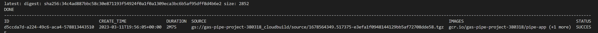

# Exploring Gas Pipeline Incident Data in the United States

This is a webapp that explores publicly available geographical and incident data related to pipelines in the united states.

A webapp to explore and visualise the USA Gas Pipeline incident data. There are 3 versions of the jupyter notebook file which evolved from simpler techniques to using plotly. The webapp has been mostly copied from the last jupyter notebook iteration.

The following packages are used in this project:

- Numpy
- Pandas
- Streamlit
- Plotly

## File description:

- Pipeline_Project_v4 is the last iteration of the notebook. I have experimented with different methods of presenting geographical information including geopandas and shapely in the previous versions. 
- pipe-app.py is the streamlit webapp based on the last notebook.
- Dockerfile: for cloud deployment
- Data: contains geospacial data as well as the incident data. the code reads and presents both sets of data. Some preprocessing has been done in previous versions of the code and the results are stored in pickle files. 

## Deployment (on GCP)
- Create your new project

- Build the project using the git repository: 

- Once the build has been successful you can deploy the project on GCP

- Since GCP charges a lot of money, I have taken the project down; however, it is still up in [here](https://gas-pipe-project.herokuapp.com/): 

I would like to acknowledge the following websites and resources:
- [GeoPandas Tutorial: How to plot US Maps in Python](https://jcutrer.com/python/learn-geopandas-plotting-usmaps)
- [Python Plotly](https://zacks.one/python-plotly/)
- [Simplest Way to Create a Choropleth Map by U.S. States in Python](https://towardsdatascience.com/simplest-way-of-creating-a-choropleth-map-by-u-s-states-in-python-f359ada7735e)
- [Create Beautiful Geomaps with Plotly](https://medium.com/analytics-vidhya/plotly-for-geomaps-bb75d1de189f)
- [Federico Tartarini](https://github.com/FedericoTartarini/streamlit-cloud-run-youtube)